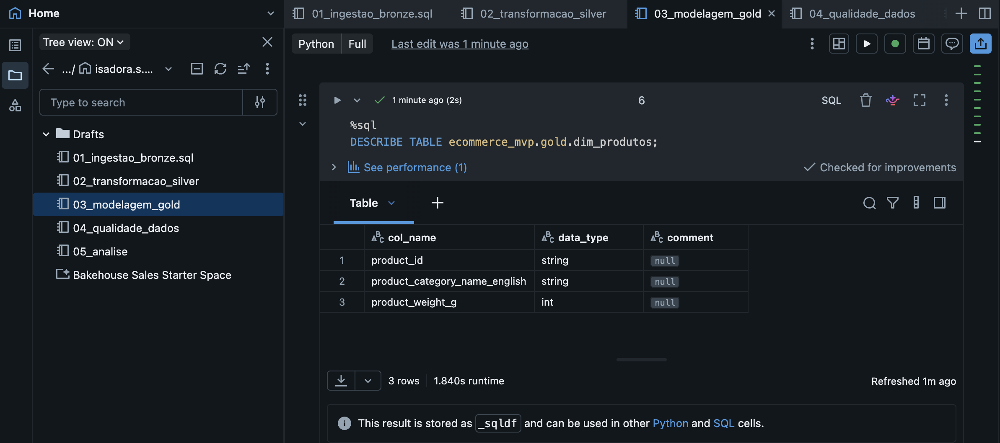
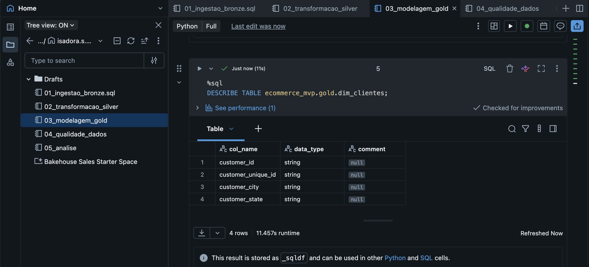
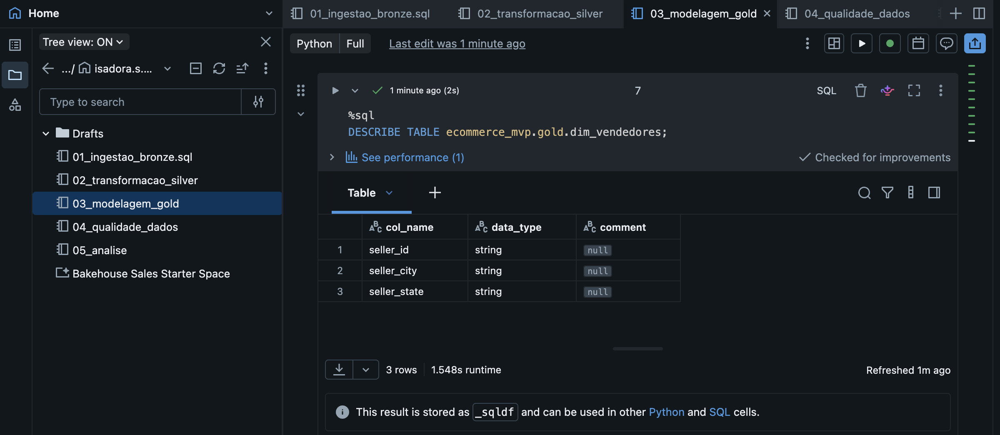
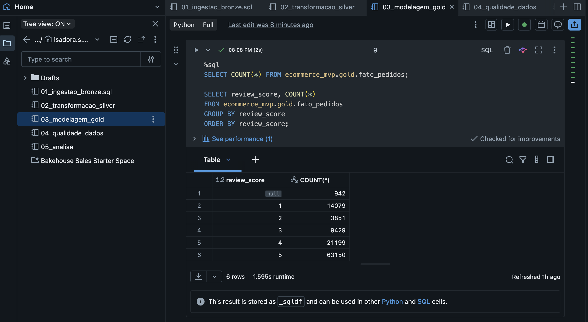
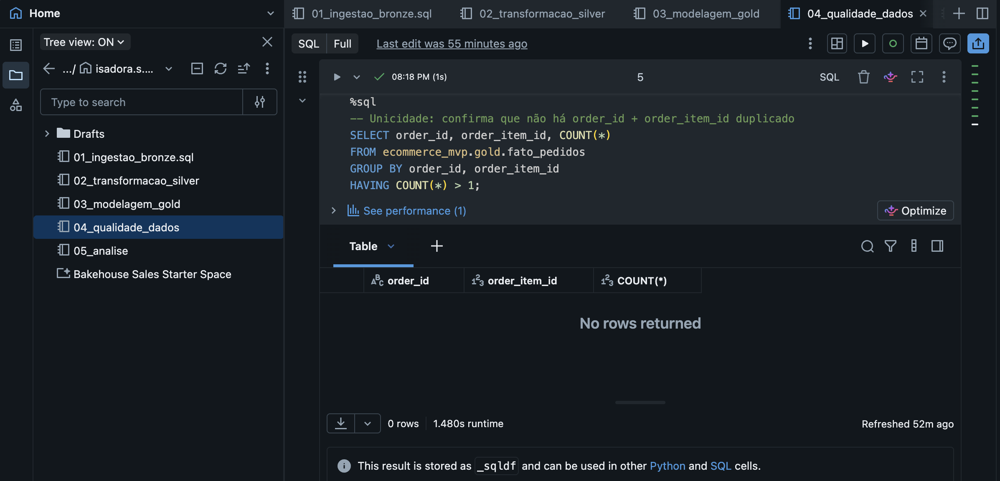
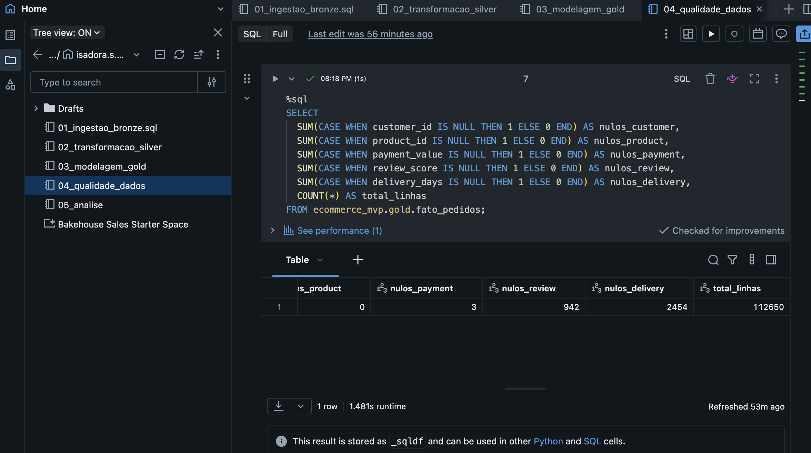
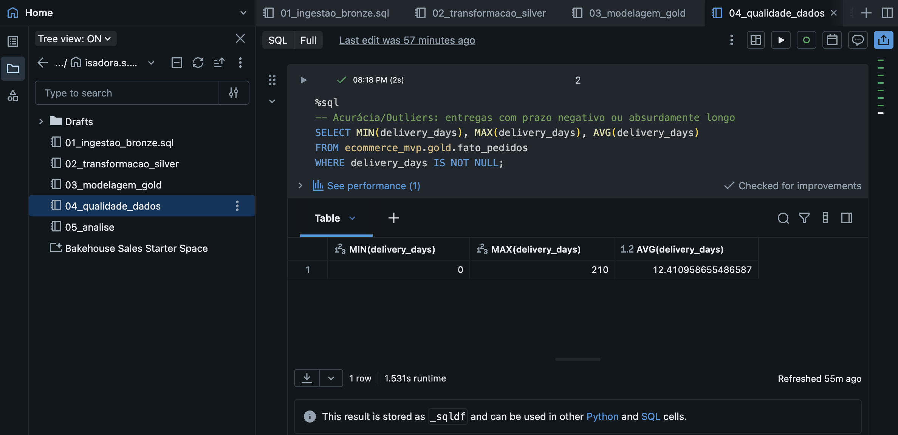
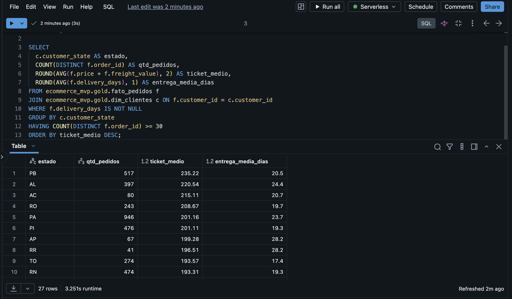
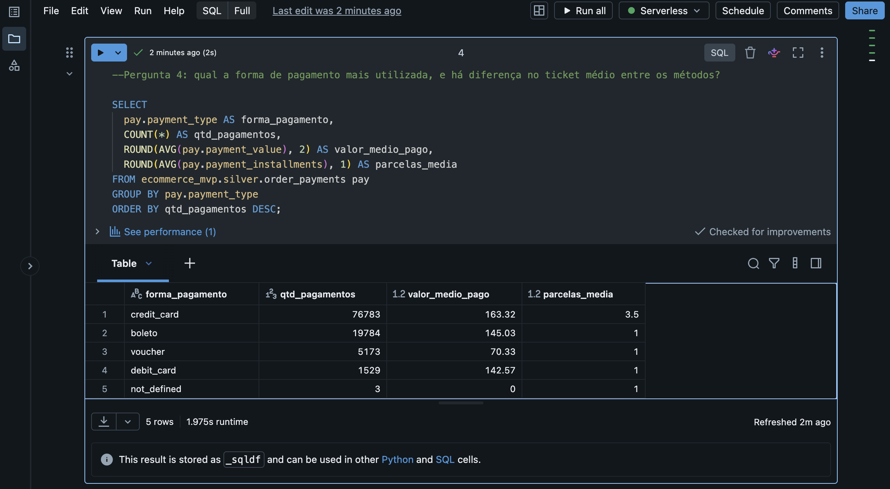
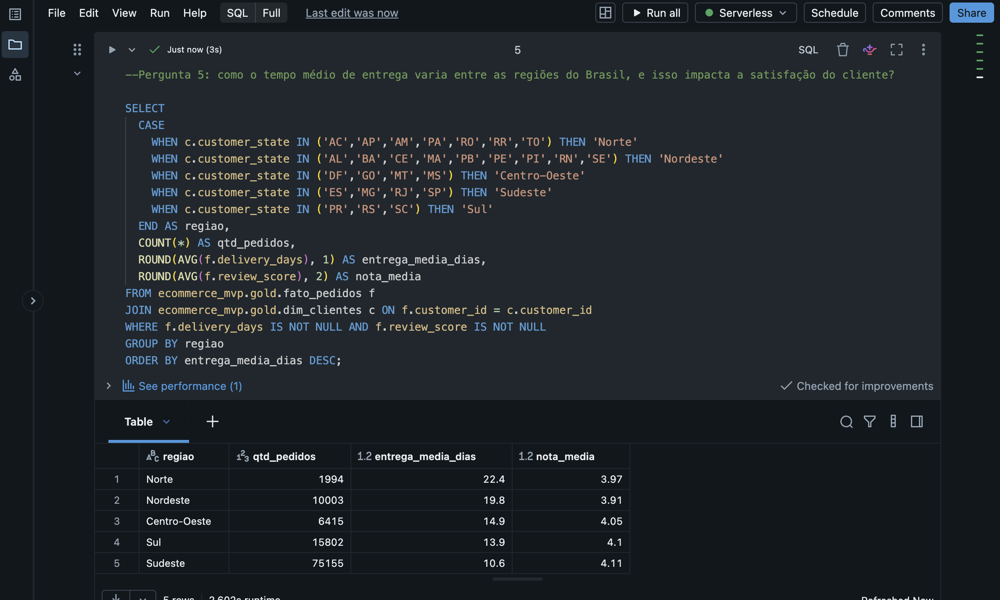

# MVP-Pipeline-de-Dados-na-Nuvem-E-commerce-Olist
Pipeline de dados end-to-end (Bronze → Silver → Gold) no Databricks, com dataset de e-commerce Olist, da ingestão à análise de negócio.

## Contexto de Negócio e Perguntas

**Problema de negócio:**
A Olist é um marketplace brasileiro que conecta pequenos e médios lojistas a grandes canais de venda online. Este trabalho busca entender quais fatores (categoria de produto, prazo e região de entrega, forma de pagamento e localização geográfica) mais influenciam a receita gerada e a satisfação do cliente (medida pela nota de avaliação), a partir dos pedidos realizados na plataforma entre 2016 e 2018. O objetivo é fornecer uma base analítica que ajude a priorizar categorias, regiões e processos logísticos com maior impacto no negócio.

**Perguntas de negócio:**
1. Quais categorias de produto geram maior receita total e maior volume de pedidos?
2. Existe relação entre atraso na entrega (diferença entre a data estimada e a data real de entrega) e a nota de avaliação (review_score) dada pelo cliente?
3. Quais estados brasileiros apresentam o maior ticket médio por pedido, e como isso se relaciona com o tempo médio de entrega nessas regiões?
4. Qual a forma de pagamento mais utilizada pelos clientes, e há diferença significativa no ticket médio entre os métodos de pagamento?
5. Como o tempo médio de entrega varia entre as regiões do Brasil (Norte, Nordeste, Centro-Oeste, Sudeste, Sul), e essa variação impacta a satisfação do cliente?

**Contexto e estrutura dos dados brutos:**
Dataset público "Brazilian E-Commerce Public Dataset by Olist" (Kaggle), com pedidos de 2016-2018 de um marketplace brasileiro. Sao 9 as tabelas originais e um resumo de suas colunas principais são: 

1. orders - pedido em si (uma linha por pedido)
order_id, customer_id, order_status, order_purchase_timestamp, order_approved_at, order_delivered_carrier_date, order_delivered_customer_date, order_estimated_delivery_date

2. order_items - itens de cada pedido (uma linha por item/produto dentro do pedido)
order_id, order_item_id, product_id, seller_id, shipping_limit_date, price, freight_value

3. order_payments - pagamentos de cada pedido (pode haver mais de um por pedido)
order_id, payment_sequential, payment_type, payment_installments, payment_value

4. order_reviews - avaliação deixada pelo cliente
review_id, order_id, review_score, review_comment_title, review_comment_message, review_creation_date, review_answer_timestamp

5. customers - dados do cliente e localização
customer_id, customer_unique_id, customer_zip_code_prefix, customer_city, customer_state

6. products - catálogo de produtos
product_id, product_category_name, product_name_lenght, product_description_lenght, product_photos_qty, product_weight_g, product_length_cm, product_height_cm, product_width_cm

7. sellers - dados do vendedor e localização
seller_id, seller_zip_code_prefix, seller_city, seller_state

8. geolocation - coordenadas por CEP (prefixo)
geolocation_zip_code_prefix, geolocation_lat, geolocation_lng, geolocation_city, geolocation_state

9. product_category_name_translation - tradução das categorias (PT→EN)
product_category_name, product_category_name_english

.catalogo_silver.png)

**Licença de uso:**

Este projeto utiliza o conjunto de dados [Brazilian E-Commerce Public Dataset by Olist](https://kaggle.com), disponibilizado pela [Olist](https://olist.com) na plataforma Kaggle.
Os dados originais e qualquer trabalho derivado direto estão protegidos sob a licença **[Creative Commons Attribution-NonCommercial-ShareAlike 4.0 International (CC BY-NC-SA 4.0)](https://creativecommons.org)**.

---

## Coleta dos Dados (Etapa 4.2)

Download dos CSVs originais direto pelo Kaggle e upload manual para um Volume do Unity Catalog no Databricks (Catalog Explorer > Create Volume > Upload). Não houve web scraping nem API, pois os dados já vinham em arquivo pronto.

---

## Modelagem e Catálogo de Dados (Etapa 4.3)

**Modelo escolhido:** Esquema Estrela (Star Schema)

- **fato_pedidos:** grão: um item de pedido. Métricas: valor do item, valor do frete, quantidade.
- **dim_clientes: **dados únicos de cliente e localização.
- **dim_produtos**: categoria, peso, dimensões.
- **dim_vendedores: **localização do vendedor.
- **dim_tempo: **data de compra, ano, mês, dia da semana.

.catalogo_gold.png)

**Catálogo de Dados:**

**Tabela: fato_pedidos**

 
**Tabela: dim_produtos**

**Tabela: dim_clientes**

**Tabela: dim_vendedores**

 

---

## Pipeline de Dados (Etapa 4.4)

O pipeline foi dividido em 5 notebooks sequenciais no Databricks, refletindo a progressão da Arquitetura Medalhão (Bronze → Silver → Gold) mais duas etapas de verificação e consumo:

- **`01_ingestao_bronze`**: lê os 9 arquivos CSV originais do Volume e os grava como tabelas Delta na camada Bronze, preservando os dados como vieram da fonte (com exceção da tabela `order_reviews`, que exigiu tratamento especial na própria ingestão — ver observação abaixo).
- **`02_transformacao_silver`**: aplica limpeza e padronização sobre as tabelas Bronze, gerando a camada Silver.
- **`03_modelagem_gold`**: constrói o Esquema Estrela final (`fato_pedidos` + dimensões) a partir das tabelas Silver.
- **`04_qualidade_dados`**: executa as verificações de completude, unicidade, consistência e acurácia sobre as tabelas Gold, e consultas complementares para o Catálogo de Dados.
- **`05_analise`**: contém as queries que respondem às 5 perguntas de negócio definidas no objetivo.

A execução é manual e sequencial (célula a célula, notebook a notebook, na ordem numerada acima), sem uso de Databricks Workflows para agendamento automático, adequado ao escopo de MVP deste trabalho.

**Transformações realizadas (Bronze → Silver):**
- **order_reviews**: na própria ingestão Bronze, foi necessário definir um schema explícito e usar o modo `DROPMALFORMED`, pois o CSV original apresentava linhas malformadas (colunas desalinhadas por aspas não escapadas em comentários de texto livre). Na Silver, os valores de `review_score` foram convertidos para inteiro (`CAST`) e registros duplicados removidos.
- **orders**: conversão das colunas de data (`order_purchase_timestamp`, `order_delivered_customer_date`, `order_estimated_delivery_date`) de string para timestamp, e remoção de duplicatas por `order_id`.
- **order_items**: remoção de duplicatas exatas e filtro de registros com `price` ou `freight_value` negativos.
- **order_payments**: remoção de duplicatas exatas e filtro de `payment_value` negativo.
- **customers, products, sellers**: remoção de duplicatas.
- **Agregação pré-JOIN (correção de fan-out)**: identificado durante a verificação de qualidade que pedidos com múltiplos registros de pagamento ou múltiplas avaliações causavam duplicação de linhas ao montar a tabela fato (um mesmo item de pedido aparecia mais de uma vez). Corrigido criando as tabelas intermediárias `order_payments_agg` (soma de `payment_value` por `order_id`) e `order_reviews_agg` (média de `review_score` por `order_id`) antes do JOIN final na Gold.
- **Tradução de categoria**: o campo `product_category_name` é traduzido para inglês via JOIN com `product_category_name_translation` já na construção da `dim_produtos`, na camada Gold.

**Referência aos scripts no GitHub:** 
https://github.com/isasousa98/MVP-Pipeline-de-Dados-na-Nuvem-E-commerce-Olist/tree/main/notebooks

**Evidência de persistência:** ver screenshots do Catalog Explorer nas seções de Modelagem e Qualidade de Dados, mostrando as tabelas Bronze, Silver e Gold salvas na plataforma.

---

## Qualidade de Dados (Etapa 4.5)

Durante a construção do pipeline, a verificação de qualidade identificou e tratou os seguintes problemas nos dados brutos:

**1. Malformação na tabela de reviews (Consistência)**
O arquivo `olist_order_reviews_dataset.csv` continha registros com colunas desalinhadas: comentários de texto livre com aspas não escapadas corretamente faziam com que valores de outras colunas (como datas) fossem lidos incorretamente na coluna `review_score`. Corrigido na ingestão Bronze definindo um schema explícito para a tabela e utilizando o modo `DROPMALFORMED`, que descarta automaticamente linhas que não correspondem ao formato esperado.

**2. Duplicação por fan-out no JOIN com pagamentos (Unicidade)**
Um mesmo pedido pode ter múltiplos registros de pagamento (ex: pagamento parcelado ou combinação de métodos). O JOIN direto entre `order_items` e `order_payments` por `order_id` causava duplicação das linhas de item de pedido (fan-out). Corrigido pré-agregando os pagamentos por `order_id` (somando `payment_value`) antes do JOIN final na tabela fato.

**3. Duplicação por fan-out no JOIN com avaliações (Unicidade)**
De forma semelhante, pedidos com mais de uma avaliação registrada geravam múltiplas linhas para o mesmo item de pedido. Corrigido pré-agregando as avaliações por `order_id`, utilizando a média (arredondada) do `review_score` quando havia mais de uma nota para o mesmo pedido.

**4. Completude**
Verificação de valores nulos na tabela `fato_pedidos` (112.650 linhas, após correção de duplicação por fan-out): 0% de nulos em `customer_id` e `product_id`, 0,003% (3 registros) em `payment_value`, 0,8% (942 registros) em `review_score` e 2,2% (2.454 registros) em `delivery_days`. Esses nulos foram considerados situações de negócio válidas (pedidos ainda não entregues, avaliações não realizadas) e não erros de dado, portanto os registros foram mantidos — mas resultam em exclusão automática nas análises que dependem especificamente dessas colunas.

**5. Acurácia e Outliers**
A distribuição de `delivery_days` (110.196 registros não nulos) mostrou mínimo de 0 dias (nenhum valor negativo, ou seja, nenhum caso de entrega antes da compra) e máximo de 210 dias, frente a uma média de 12,4 dias. A análise da distribuição revelou que 82.606 pedidos (75%) foram entregues em até 15 dias, 22.838 (21%) entre 16-30 dias, 4.431 (4%) entre 31-60 dias, e apenas 321 pedidos (0,3%) levaram mais de 60 dias. Optei por manter esses casos extremos no dataset, já que representam atrasos logísticos reais e relevantes para a pergunta de negócio sobre relação entre atraso na entrega e satisfação do cliente.

---

## Análise de Dados (Etapa 4.5)

### Pergunta 1: Quais categorias de produto geram maior receita total e maior volume de pedidos?

A categoria **health_beauty** (saúde e beleza) lidera em receita total (R$ 1.258.681,34), seguida de perto por **watches_gifts** (relógios e presentes, R$ 1.205.005,68), mesmo esta última tendo quase 40% menos itens vendidos que a líder (5.991 vs 9.670), o que se explica pelo ticket médio bem mais alto (R$ 201,14 contra R$ 130,16). Isso mostra que receita alta pode vir tanto de alto volume (como em bed_bath_table, com 11.115 itens vendidos, mas ticket médio de apenas R$ 93,30) quanto de ticket elevado (como watches_gifts).
As categorias **bed_bath_table** (cama, mesa e banho) e **sports_leisure** (esporte e lazer) aparecem logo em seguida em receita, sustentadas principalmente por alto volume de vendas. Já **cool_stuff** e **office_furniture**, apesar de volumes bem menores (3.796 e 1.691 itens), mantêm receita relevante por terem ticket médio entre os mais altos do top 15 (R$ 167,36 e R$ 162,01).
**Conclusão:** não existe um único padrão de sucesso comercial na Olist: categorias de maior receita se dividem entre "alto volume, ticket baixo" (moda popular/casa) e "baixo volume, ticket alto" (presentes, eletrônicos, mobiliário de escritório). Isso é relevante para decisões de negócio: estratégias de marketing e estoque devem ser diferentes para cada perfil de categoria.

### Pergunta 2: Existe relação entre atraso na entrega (diferença entre a data estimada e a data real de entrega) e a nota de avaliação (review_score) dada pelo cliente? 

Sim, a relação é forte e direta. Pedidos entregues no prazo ou antes (102.285 casos, a grande maioria) têm nota média de **4,21,** próxima da nota máxima (5). Já pedidos com atraso leve, de 1 a 7 dias além do prazo estimado (4.031 casos), caem para nota média **2,68**. E pedidos com atraso grande, de 8 dias ou mais (3.053 casos), despencam para nota média **1,70, **próxima da nota mínima (1).
Isso significa que **cada faixa adicional de atraso reduz a satisfação do cliente de forma acentuada**: a diferença entre "no prazo" e "atraso leve" já é de 1,5 ponto na nota média, e entre "no prazo" e "atraso grande" chega a 2,5 pontos, mais da metade da escala de avaliação.
**Conclusão:** a pontualidade da entrega é um dos fatores mais determinantes na satisfação do cliente na Olist. Mesmo um atraso pequeno (1-7 dias) já é suficiente para derrubar a nota média de "muito bom" para "regular/ruim". Isso reforça a importância estratégica de investimentos em logística e em comunicação realista de prazos de entrega ao cliente (evitar prometer prazos otimistas demais que geram expectativa de pontualidade).

### Pergunta 3: Quais estados brasileiros apresentam o maior ticket médio por pedido, e como isso se relaciona com o tempo médio de entrega?

Os estados com maior ticket médio são majoritariamente do **Norte e Nordeste**: Paraíba (R$ 235,22), Alagoas (R$ 220,54), Acre (R$ 215,11), Rondônia (R$ 208,67) e Pará (R$ 201,16) lideram o ranking. Esses mesmos estados também apresentam os **tempos de entrega mais longos: **Amapá e Roraima chegam a 28,2 dias em média, contra os estados líderes de ticket.
No extremo oposto, **São Paulo** tem o menor ticket médio (R$ 124,21) e também a entrega mais rápida do país (8,7 dias), seguido por Paraná e Minas Gerais (11,9 dias), estados do Sul/Sudeste, mais próximos dos centros de distribuição e vendedores da plataforma.
A correlação é visível: quanto mais distante o estado dos grandes centros logísticos do Sudeste, maior tende a ser tanto o ticket médio (puxado pelo custo de frete mais alto) quanto o tempo de entrega. São Paulo sozinho concentra 40.495 pedidos (mais de um terço do total da base), o que reflete tanto o peso populacional/econômico do estado quanto a proximidade logística, provavelmente concentração de centros de distribuição e vendedores na região.
**Conclusão:** o ticket médio elevado em estados do Norte/Nordeste não indica necessariamente clientes que compram itens mais caros, mas sim o peso do frete no valor total pago, o que sugere uma oportunidade de negócio: expandir centros de distribuição regionais poderia reduzir custo de frete e tempo de entrega nessas regiões, potencialmente aumentando conversão e satisfação nesses mercados hoje mais caros e mais lentos de atender.

Detalhe importante: usei price + freight_value pro ticket médio (não só price), porque o valor total que o cliente efetivamente paga inclui o frete, e frete costuma variar bastante por região, o que é relevante pra essa pergunta. Também filtrei estados com pelo menos 30 pedidos (HAVING), pra evitar que um estado com 2-3 pedidos isolados distorça o ranking com médias não confiáveis.

### Pergunta 4: Qual a forma de pagamento mais utilizada pelos clientes, e há diferença significativa no ticket médio entre os métodos de pagamento?

O **cartão de crédito** é disparado a forma de pagamento mais utilizada, representando 76.783 pagamentos (cerca de 74% do total), com valor médio de R$ 163,32 e média de 3,5 parcelas, evidenciando que o parcelamento é um fator relevante no comportamento de compra na plataforma. Em seguida vem o **boleto bancário** (19.784 pagamentos, ~19%), com valor médio de R$ 145,03, sempre à vista (1 parcela, já que boleto não permite parcelamento).
**Voucher** (5.173 pagamentos) tem o menor valor médio entre os métodos relevantes (R$ 70,33), sugerindo uso em compras de menor valor ou complementando outro método de pagamento. **Débito** é o menos usado entre os métodos "reais" (1.529 pagamentos, ~1,5%), com valor médio de R$ 142,57. Os 3 registros "not_defined" são residuais e não afetam a análise.
**Conclusão:** o cartão de crédito parcelado é claramente o método preferido, o valor médio mais alto entre os métodos principais, combinado com quase 3,5 parcelas em média, sugere que a possibilidade de parcelamento é um fator relevante para viabilizar compras de maior valor na plataforma. Isso é uma informação estratégica: manter e possivelmente expandir opções de parcelamento no cartão de crédito tende a favorecer o ticket médio da plataforma.

### Pergunta 5: Como o tempo médio de entrega varia entre as regiões do Brasil, e essa variação impacta a satisfação do cliente?

Há uma diferença considerável no tempo de entrega entre regiões: o **Sudeste** tem a entrega mais rápida (10,6 dias em média) e concentra a maioria absoluta dos pedidos (75.155, ~67% do total). Em contraste, o **Norte** tem a entrega mais lenta (22,4 dias, mais que o dobro do Sudeste), seguido do **Nordeste** (19,8 dias).
O impacto na satisfação segue o padrão esperado, mas de forma mais suave do que na Pergunta 2: a nota média cai de 4,11 (Sudeste) para 3,97 (Norte), uma diferença de apenas 0,14 ponto, bem menor que a queda observada entre "no prazo" e "atraso grande" (2,5 pontos). Isso sugere que **o tempo absoluto de entrega importa menos para a satisfação do que o cumprimento da promessa de prazo** (visto na Pergunta 2): um cliente do Norte que sabe que vai esperar ~22 dias e recebe dentro desse prazo tende a ficar satisfeito, enquanto um atraso em relação ao prometido, mesmo que a entrega em si seja rápida em termos absolutos , gera insatisfação muito maior.
**Conclusão:** a variação regional na velocidade de entrega é real e reflete a distância logística das regiões Norte/Nordeste em relação aos centros de distribuição concentrados no Sudeste, mas isso por si só não é o principal driver de insatisfação: o fator crítico é a diferença entre o prazo *prometido* e o prazo *cumprido* (Pergunta 2). Isso reforça a recomendação já levantada na Pergunta 3: investir em centros de distribuição regionais reduziria o tempo de entrega no Norte/Nordeste e, principalmente, tornaria as estimativas de prazo mais precisas, o que, pela Pergunta 2, é o fator que mais afeta a satisfação do cliente.

### Discussão geral

O objetivo deste trabalho era entender quais fatores (categoria de produto, prazo e região de entrega, forma de pagamento e localização geográfica) mais influenciam a receita gerada e a satisfação do cliente na Olist. As cinco análises, quando conectadas, revelam uma história coerente sobre como esses fatores se relacionam.
Do lado da **receita**, não existe um único padrão de sucesso: categorias como bed_bath_table vendem em alto volume com ticket baixo, enquanto watches_gifts e office_furniture sustentam receita relevante com ticket alto e volume menor (Pergunta 1). O método de pagamento reforça essa dinâmica: o parcelamento no cartão de crédito (74% dos pagamentos, em média 3,5 parcelas) parece ser um facilitador importante para viabilizar compras de maior valor (Pergunta 4).
Do lado da **satisfação do cliente**, o fator determinante não é o tempo de entrega em si, mas o cumprimento da promessa de prazo: atrasos de apenas 1 a 7 dias já derrubam a nota média de 4,21 para 2,68, e atrasos maiores chegam a 1,70 (Pergunta 2), uma queda muito mais acentuada do que a observada apenas por região geográfica, onde a diferença entre a região mais rápida (Sudeste, 4,11) e a mais lenta (Norte, 3,97) é de apenas 0,14 ponto (Pergunta 5).
Essas duas descobertas se conectam diretamente ao padrão geográfico identificado na Pergunta 3: estados do Norte e Nordeste têm tanto o maior ticket médio (puxado pelo custo de frete) quanto os maiores tempos de entrega, e, por consequência da Pergunta 2, são também as regiões mais expostas ao risco de atraso em relação ao prazo estimado, já que estimativas de prazo mais longas têm naturalmente mais chance de sofrer desvios.

**A conclusão central é**: a percepção de qualidade do serviço na Olist depende menos da velocidade absoluta da entrega e mais da precisão da promessa feita ao cliente. Isso aponta para duas frentes de ação com potencial de impacto real no negócio:

1- investir em centros de distribuição regionais para reduzir a distância logística até Norte/Nordeste, o que reduziria tanto o custo de frete (e, portanto, o ticket médio nessas regiões) quanto o tempo de entrega;
2- melhorar a precisão das estimativas de prazo de entrega, possivelmente sendo mais conservador nas promessas para regiões mais distantes, já que cumprir uma promessa realista tem mais impacto na satisfação do que simplesmente entregar rápido.

---

## Autoavaliação

**Objetivos atingidos:**
Consegui atingir o objetivo central proposto: construir um pipeline de dados de ponta a ponta na nuvem, cobrindo desde a ingestão dos dados brutos até a resposta às perguntas de negócio definidas no início do trabalho. As cinco camadas do pipeline (Bronze, Silver, Gold, verificação de Qualidade de Dados e Análise) foram implementadas e documentadas em notebooks separados e organizados no Databricks, com o código versionado no GitHub. Das cinco perguntas de negócio formuladas na etapa de Objetivo, todas foram respondidas com evidência quantitativa, e os resultados se conectaram de forma coerente entre si, permitindo uma discussão geral consistente sobre os fatores que influenciam a satisfação do cliente e a receita na plataforma.

**Dificuldades encontradas:**
Por ser iniciante em Databricks, SQL e PySpark, enfrentei uma curva de aprendizado real ao longo do trabalho, desde entender a diferença entre Workspace, Catalog, Schema e notebooks, até descobrir como navegar e organizar arquivos dentro da plataforma. Cometi o erro inicial de pular a camada Silver e ir direto de Bronze para Gold, o que tive que corrigir depois para seguir corretamente a Arquitetura Medalhão pedida na especificação.

O maior desafio técnico foi identificar e corrigir dois problemas de qualidade de dados que não eram óbvios à primeira vista: 
1- a tabela de reviews vinha malformada da fonte, com colunas desalinhadas por conta de aspas não escapadas em comentários de texto livre;
2- um problema de duplicação por fan-out nos JOINs com as tabelas de pagamentos e avaliações, causado por pedidos com múltiplos registros de pagamento ou múltiplas avaliações. 

Ambos exigiram investigação cuidadosa (comparar contagens de linhas antes e depois, validar com queries de verificação) até chegar à causa raiz e à correção adequada.

**Trabalhos futuros:**
Com mais tempo, calma e experiencia, gostaria de aprofundar a análise geográfica construindo uma dimensão de tempo (dim_tempo) completa, permitindo analisar sazonalidade nas vendas ao longo dos meses e dias da semana. Também seria valioso investigar mais a fundo os 338 pedidos com atraso extremo (60+ dias) identificados na etapa de Qualidade de Dados, buscando entender se há um padrão comum entre eles (região específica, categoria de produto, período do ano) que pudesse orientar ações preventivas. Por fim, um próximo passo natural seria transformar essa análise em um dashboard interativo (por exemplo, com Databricks SQL Dashboards) para que as descobertas pudessem ser consultadas continuamente por áreas de negócio, em vez de ficarem restritas a este documento estático.

---

## Licença dos dados

Este projeto utiliza o conjunto de dados [Brazilian E-Commerce Public Dataset by Olist](https://kaggle.com), disponibilizado pela [Olist](https://olist.com) na plataforma Kaggle.
Os dados originais e qualquer trabalho derivado direto estão protegidos sob a licença **[Creative Commons Attribution-NonCommercial-ShareAlike 4.0 International (CC BY-NC-SA 4.0)](https://creativecommons.org)**.
Isso significa que você é livre para:
* **Compartilhar:** Copiar e redistribuir o material em qualquer suporte ou formato.
* **Adaptar: **Remisturar, transformar e criar a partir do material.

Sob os seguintes termos:
* **Atribuição (BY):** Você deve dar o crédito apropriado à Olist e ao Kaggle, prover um link para a licença e indicar se mudanças foram feitas.
* **Não Comercial (NC): **Você não pode usar o material para fins comerciais.
* **CompartilhaIgual (SA): **Se você remisturar, transformar ou criar a partir do material, tem que distribuir as suas contribuições sob a mesma licença que o original.
